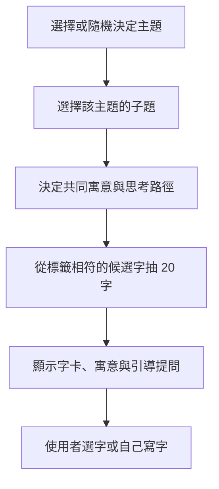
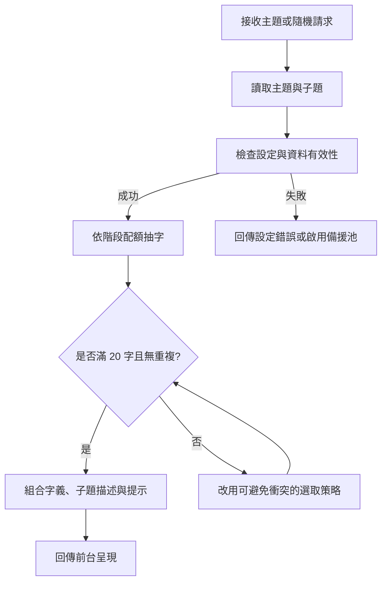

# 辰墨軒｜智慧主題選字系統設計規格書

> 文件版本：v1.0  
> 日期：2026-10-10  
> 專案網站：https://chenmo-99237960339.asia-east1.run.app/  
> 文件用途：產品構想、UI/UX、字庫編輯、後端 API 與開發驗收依據

---

## 1. 專案背景與目的

目前網站提供「自選字」字池：當學生或訪客不知道要寫什麼字時，系統從字池隨機抽取 20 字。現有做法的優點是簡單、維護容易；不足是抽到的字未必彼此相關，也無法對應使用者想表達的心情或提問。

**升級目標：從「隨機給 20 個字」改為「提供 20 個具有同一主題、可說明關聯與寓意的字」。**

### 1.1 三項核心需求

1. **持續擴充：**字庫可以依主題、子題、寓意與標籤增刪，不需要改程式。
2. **更有意義：**字不只是常用字，還要有簡短、合理且可理解的選字理由。
3. **彼此有關聯：**每次產生的 20 字要有共同主軸，最好能呈現一段「思考路徑」，而不是 20 個不相干的名詞。

### 1.2 設計原則

- **先有意義，再有隨機：**先決定主題與子題，再從符合條件的字集合抽樣。
- **可解釋：**每組字要能用一段白話說明它們為什麼放在一起。
- **有選擇，不強迫：**使用者可以自己輸入字，也可以接受建議。
- **書寫友善：**優先採繁體中文、字形清楚、適合單字書寫的漢字。
- **文化解讀而非預言：**字義與測字內容作為文化、書寫及自我反思的引導，不宣稱能證明或預知未來。
- **相容舊資料：**保留原有純文字字池作為備援。

---

## 2. 功能範圍

### 2.1 V1（優先開發）

| 功能 | 說明 | 優先序 |
|---|---|---|
| 主題選字 | 12 大主題，按主題抽 20 字 | P0 |
| 每組關聯 | 同一主題中依子題、語意標籤抽樣 | P0 |
| 重抽本組 | 保留目前主題，換一組字 | P0 |
| 換個主題 | 切換到其他主題 | P0 |
| 字義提示 | 點擊字卡顯示簡短寓意、關鍵詞 | P0 |
| 原字池相容 | 結構化檔案讀取失敗時回退舊字池 | P0 |
| 教師可維護 | 編輯字庫設定檔，部署／重啟後生效 | P0 |
| 無重複輸出 | 單次 20 字不能重複 | P0 |
| 使用者自填 | 不受系統推薦字限制 | P0 |
| 今日一題 | 題目引導（例如「最近想突破什麼？」） | P1 |
| 搜尋與篩選 | 依主題、心情、難易度篩選 | P1 |
| 管理後台 | 無需編輯檔案即可增刪字 | P2 |
| 個人化推薦 | 依使用者選擇的情境推薦 | P2 |

> P0 = 核心必做；P1 = 下一階段；P2 = 後續擴充。

### 2.2 建議保留的使用入口

- **我已經有字：**直接在原本的手寫／輸入欄位操作。
- **我不知道寫什麼：**進入智慧選字區，讓系統提供 20 字。
- **隨機給我靈感：**由系統先挑一個主題與子題，再抽 20 字。

---

## 3. 12 大主題字庫（首版）

每個主題提供 **20 個核心候選字**。此處為首版基準集合，而不是各主題的字數上限；正式上線可擴充至每類 40–100 字，讓重新抽取能有變化。

### 01｜人生方向・志向

**主題寓意：**出發、立志、堅持、開展、抵達。  
**關聯脈絡：**立志 → 啟程 → 行動 → 堅持 → 成果。  
**20 字：**志、願、夢、望、行、進、達、成、啟、程、途、路、遠、毅、勇、恆、堅、信、拓、展  
**引導提問：**「你現在最想走向哪個目標？」

### 02｜情感緣分・人際

**主題寓意：**相遇、相識、理解、珍惜、維繫。  
**關聯脈絡：**遇見 → 相知 → 建立信任 → 珍惜關係。  
**20 字：**緣、遇、情、愛、念、思、惜、盼、守、伴、合、和、信、誠、諒、恩、親、知、暖、聚  
**引導提問：**「你最想珍惜或改善的是哪段關係？」

### 03｜心境修養・內在

**主題寓意：**安定、清明、自省、包容、平衡。  
**關聯脈絡：**靜心 → 觀察 → 省思 → 領悟 → 寬容。  
**20 字：**靜、安、定、寧、清、明、悟、慧、覺、省、思、淡、真、善、柔、寬、容、謙、恕、平  
**引導提問：**「你現在最希望心裡多一點什麼？」

### 04｜事業成就・工作

**主題寓意：**能力、專注、策略、責任、成長。  
**關聯脈絡：**發揮才能 → 專業投入 → 規劃執行 → 產生成果。  
**20 字：**業、職、才、能、創、建、策、謀、勤、精、專、實、績、升、任、責、成、功、展、興  
**引導提問：**「你在工作或學習上，想完成什麼？」

### 05｜財富豐足・生活

**主題寓意：**積累、富足、穩健、共享、安泰。  
**關聯脈絡：**創造價值 → 累積資源 → 穩健安排 → 生活富足。  
**20 字：**財、富、裕、豐、盈、利、益、蓄、積、聚、穩、足、盛、昌、隆、興、福、祿、泰、惠  
**引導提問：**「對你而言，真正的富足是什麼？」

### 06｜家庭親情・歸屬

**主題寓意：**親情、照顧、傳承、和睦、歸屬。  
**關聯脈絡：**親情連結 → 關懷照顧 → 共同成長 → 安心歸屬。  
**20 字：**家、親、孝、慈、恩、愛、護、育、承、傳、和、睦、團、聚、暖、安、居、根、歸、福  
**引導提問：**「什麼讓你感到有家的溫度？」

### 07｜山水自然・天地

**主題寓意：**山川、草木、氣候、天象、自然之美。  
**關聯脈絡：**大地山川 → 林木生長 → 風雨流轉 → 天光星月。  
**20 字：**山、水、川、海、江、河、泉、溪、峰、嶺、林、森、松、竹、雲、風、雨、雪、月、星  
**引導提問：**「哪一種自然景象最像你現在的心情？」

### 08｜時序變化・轉機

**主題寓意：**季節輪替、開始與結束、變化與新生。  
**關聯脈絡：**時間推移 → 階段轉折 → 調整方向 → 再次開始。  
**20 字：**春、夏、秋、冬、晨、夕、朝、暮、初、終、始、末、新、舊、轉、變、化、復、續、生  
**引導提問：**「你正在迎接哪一段新的開始？」

### 09｜學問智慧・探索

**主題寓意：**好奇、學習、求證、理解、智慧。  
**關聯脈絡：**發問 → 觀察 → 學習 → 研究 → 領悟。  
**20 字：**學、習、知、識、智、慧、問、思、研、究、察、觀、解、悟、明、理、道、法、文、博  
**引導提問：**「你最近最想弄懂的一件事是什麼？」

### 10｜抉擇進退・得失

**主題寓意：**比較、選擇、取捨、勇於決定。  
**關聯脈絡：**看見選項 → 衡量得失 → 做出決定 → 承擔結果。  
**20 字：**選、擇、取、捨、進、退、去、留、得、失、利、弊、衡、斷、決、定、機、變、守、放  
**引導提問：**「你目前有哪些想做卻尚未決定的事？」

### 11｜吉祥祝福・祈願

**主題寓意：**福氣、平安、喜樂、順遂、祝願。  
**關聯脈絡：**心存祝願 → 期盼安康 → 共享喜悅。  
**20 字：**福、祿、壽、喜、吉、祥、瑞、慶、樂、康、泰、安、順、興、旺、昌、隆、盛、如、意  
**引導提問：**「你最想送給自己或他人的祝福是什麼？」

### 12｜文人雅趣・藝術

**主題寓意：**書寫、審美、雅趣、文化、藝術。  
**關聯脈絡：**文房工具 → 藝術實踐 → 品味意境 → 生活雅趣。  
**20 字：**詩、書、畫、琴、棋、墨、筆、硯、雅、韻、逸、趣、藝、文、香、茶、竹、蘭、梅、菊  
**引導提問：**「你想用哪一個字表達今天的意境？」

### 3.1 字庫品質檢查

- 每個主題內 20 字**不重複**；不同主題間**允許同一字重複**，例如「安」同時屬於心境、家庭、祝福。
- 第一版不應把「主題內 20 字」誤當成有 20 種不同的重抽結果；重抽功能需透過擴充池、子題或不同排序實現。
- 少見字、異體字、簡體字應由編輯審核後才加入，避免顯示、書寫與寓意問題。

---

## 4. 關鍵設計：讓「一組 20 字」彼此有關聯

單靠 12 大主題仍然可能太廣。例如「人生方向」裡，同時抽出「夢、信、拓、遠、成」雖然相關，但使用者不一定能理解這一組的邏輯。

因此建議採 **「主題 → 子題 → 關聯脈絡 → 字詞」四層模型**。

### 4.1 四層結構



### 4.2 具體示例：人生方向 → 突破困境

**子題介紹：**「遇見阻礙時，思考如何調整、前進與堅持。」  
**關聯脈絡：**困境 → 思考 → 選擇 → 行動 → 成長。

| 階段 | 推薦字 | 關聯意義 |
|---|---|---|
| 看見困境 | 難、阻、困、關 | 認清現在的挑戰 |
| 重新思考 | 思、省、察、悟 | 理解自己與局勢 |
| 做出選擇 | 擇、決、轉、變 | 尋找可以前進的方向 |
| 實際行動 | 行、勇、毅、堅 | 保持行動與韌性 |
| 成長結果 | 新、開、達、成 | 走出新的可能性 |

**本組 20 字：**難、阻、困、關、思、省、察、悟、擇、決、轉、變、行、勇、毅、堅、新、開、達、成。

這種形式不只是抽字，也是讓使用者透過字義進行一次簡短的自我探索。

### 4.3 第二個示例：情感緣分 → 珍惜關係

**關聯脈絡：**相遇 → 了解 → 信任 → 珍惜 → 相伴。  
**本組 20 字：**遇、緣、逢、識、知、聽、解、諒、信、誠、真、和、惜、恩、念、護、伴、守、暖、聚。

### 4.4 第三個示例：心境修養 → 找回平靜

**關聯脈絡：**覺察 → 放慢 → 整理 → 安定 → 清明。  
**本組 20 字：**覺、察、觀、省、緩、息、靜、淡、捨、放、容、寬、定、安、寧、平、清、明、慧、悟。

### 4.5 建議的抽樣比例

為了避免某個關聯階段的字過多，首版建議**固定 5 個階段，每階段選 4 字**，合計 20 字。每個子題的每個階段應備妥至少 6–10 個候選字，才能重抽。

若子題結構不是 5 階段，亦可使用配額設定，例如 4 階段各選 5 字；**切忌對所有主題硬套同一種敘事**。自然主題可用「山川／草木／風雨／天象」，藝術主題可用「工具／創作／品味／意象」。

---

## 5. 前台介面與互動流程

### 5.1 建議畫面

```text
┌──────────────────────────────────────────────┐
│                辰 墨 軒                     │
│           一字一念，從心出發                 │
│                                              │
│  想寫什麼字？                                │
│  [ 我自己有字 ]   [ 幫我找靈感 ]              │
│                                              │
│  選擇你想探索的方向                          │
│  [人生方向] [情感緣分] [心境修養] [更多主題]   │
│                                              │
│  今天的主題：突破困境                        │
│  寓意：困境 → 思考 → 選擇 → 行動 → 成長        │
│                                              │
│  [難] [阻] [困] [關] [思]                    │
│  [省] [察] [悟] [擇] [決]                    │
│  [轉] [變] [行] [勇] [毅]                    │
│  [堅] [新] [開] [達] [成]                    │
│                                              │
│  [重抽本組] [換個主題] [我自己寫字]            │
│                                              │
│  點選某字 → 查看字義與書寫／測字入口          │
└──────────────────────────────────────────────┘
```

### 5.2 字卡互動

點選「毅」字時，可以顯示：

- **字：**毅
- **核心寓意：**堅定、不輕易放棄。
- **所屬階段：**實際行動。
- **延伸提問：**「最近哪件事需要你多一點毅力？」
- **操作：**「就寫這個字」或「返回選字」。

### 5.3 操作規則

1. 初次進入：可預設顯示一組隨機主題，或讓使用者先選主題；建議以「先選主題」為主。
2. 點擊「重抽本組」：**維持主題與子題**，改變候選字組合；若暫無額外候選，明確告知而非假裝重抽。
3. 點擊「換個主題」：重新選主題與子題。
4. 點擊字卡：開啟解釋，不直接覆蓋使用者已寫的內容。
5. 點擊「就寫這個字」：把字帶入既有手寫／輸入或測字流程。
6. 手機版：自動切換為適合螢幕寬度的網格，例如每排 4–5 字。

---

## 6. 字庫資料格式設計

### 6.1 為何不只用原來的 TXT？

原先格式：

```text
# 註解
日月星雲山水火木金土...
```

優點是方便編輯，但無法記錄「主題、子題、寓意、階段、引導問題」等資訊。建議採 **JSON 或 YAML** 結構化字庫，舊 TXT 留作備援。

### 6.2 建議目錄

```text
app/
├── data/
│   ├── character_pool.txt          # 舊版字池（備援）
│   ├── themes.json                 # 主題資訊
│   ├── groups.json                 # 子題及分階段候選字
│   └── character_meanings.json     # 單字寓意（可持續擴充）
├── services/
│   └── character_picker.py         # 選字演算法
├── api/
│   └── characters.py               # API 路由（若採 FastAPI）
└── templates/
    └── character_picker.html       # 前台（依現有架構調整）
```

> 路徑為建議方案，不代表已確認現有網站的技術堆疊或實際檔名。

### 6.3 `themes.json` 範例

```json
{
  "version": "1.0",
  "themes": [
    {
      "id": "life",
      "name": "人生方向・志向",
      "description": "探索目標、行動與成長",
      "group_ids": ["life_breakthrough", "life_new_start"]
    }
  ]
}
```

### 6.4 `groups.json` 範例

注意：以下是一個**可供實作與重抽的子題範例**，每階段超過 4 個候選字。

```json
{
  "version": "1.0",
  "groups": [
    {
      "id": "life_breakthrough",
      "theme_id": "life",
      "name": "突破困境",
      "summary": "面對阻礙，從理解到行動，再走向成長",
      "prompt": "你現在最想跨越什麼困難？",
      "sample_size": 20,
      "stages": [
        {"name": "看見困境", "quota": 4, "characters": "難阻困關礙逆險滯"},
        {"name": "重新思考", "quota": 4, "characters": "思省察悟觀知辨明"},
        {"name": "做出選擇", "quota": 4, "characters": "擇決轉變取捨選定"},
        {"name": "實際行動", "quota": 4, "characters": "行勇毅堅進恆勤闖"},
        {"name": "成長結果", "quota": 4, "characters": "新開達成展升通越"}
      ]
    }
  ]
}
```

### 6.5 `character_meanings.json` 範例

```json
{
  "毅": {
    "meaning": "堅定意志，面對困難仍願意持續努力",
    "keywords": ["堅持", "勇氣", "行動"],
    "question": "你想把毅力用在哪件事上？"
  },
  "轉": {
    "meaning": "轉換角度、調整方向，也象徵改變的契機",
    "keywords": ["改變", "方向", "轉機"],
    "question": "有什麼事值得換個角度再看一次？"
  }
}
```

### 6.6 資料規則

- 單字欄位必須是一個完整的 Unicode 漢字（實作時以 Unicode 字素群集或明確允許的字元範圍驗證，不直接依 UTF-16 單位切割）。
- `theme_id` 與 `group_id` 必須唯一，且子題必須對應有效主題。
- `quota` 整數且大於 0，各階段配額加總必須等於 `sample_size`。
- 每一階段的去重候選字數必須 **不少於配額**。
- 為確保整體結果能選出不重複的 20 字，應以驗證或抽樣演算法檢查**跨階段候選重疊**，不能只檢查各階段數量。
- 子題的推薦語句由編輯審核，不把字的寓意描述成客觀運勢判定。
- 若不同子題可共用一字，單字寓意可共用，但子題的**情境解釋**可以另行覆寫。

---

## 7. 選字引擎演算法

### 7.1 第一版流程



### 7.2 推薦策略

**推薦 V1 使用「階段配額 + 無重複隨機抽樣」**；為避免跨階段重疊，最穩定的作法是：先檢查是否存在符合所有配額的唯一字組，再用回溯搜尋或二分匹配方式選出結果。若每階段字池互不重疊，則可簡化為各自 `random.sample()`。

1. 根據選定主題找到子題。
2. 取得子題的各階段候選字及配額。
3. 去除同階段內重複字。
4. 以不重複為限制，抽出各階段指定數量。
5. 確認輸出正好 20 個不同字。
6. 依階段排序，讓使用者可以感受到語意路徑；階段內可隨機排序。
7. 將 `theme_id`、`group_id`、`stage_name`、字義及說明一起回傳。

**重抽規則：**保存最近一組結果，若其他合法組合存在，優先產生不同於上一組的結果；若候選完全不足，應給出可理解的訊息。

### 7.3 V2 可考慮的智慧化

- 使用者選擇「工作」、「家人」、「抉擇」等情境後，將情境映射到子題。
- 使用標籤加權調整候選字，例如更偏「重新開始」或「堅持」。
- AI 可以**建議新子題與寓意草稿**，但字庫新增仍由編輯確認。
- 初期無須使用 LLM 即時生成 20 字；由**人工整理的高品質字庫 + 可解釋規則**即可達成核心需求，較好控管品質、成本與速度。

---

## 8. API 介面草案

以下以 FastAPI 的 REST 風格說明，實際名稱可對應現有架構。

| Method | Path | 功能 |
|---|---|---|
| GET | `/api/characters/themes` | 取得主題清單 |
| GET | `/api/characters/groups?theme_id=life` | 取得指定主題下的子題 |
| GET | `/api/characters/pick?group_id=life_breakthrough` | 產生同一子題的 20 字 |
| GET | `/api/characters/meaning/毅` | 取得單字寓意 |
| GET | `/api/characters/random` | 隨機選主題／子題並產生字組 |

### 8.1 抽字回應範例

```json
{
  "theme_id": "life",
  "theme_name": "人生方向・志向",
  "group_id": "life_breakthrough",
  "group_name": "突破困境",
  "summary": "面對阻礙，從理解到行動，再走向成長",
  "prompt": "你現在最想跨越什麼困難？",
  "count": 20,
  "stages": [
    {
      "name": "看見困境",
      "characters": ["難", "阻", "困", "關"]
    },
    {
      "name": "重新思考",
      "characters": ["思", "省", "察", "悟"]
    },
    {
      "name": "做出選擇",
      "characters": ["擇", "決", "轉", "變"]
    },
    {
      "name": "實際行動",
      "characters": ["行", "勇", "毅", "堅"]
    },
    {
      "name": "成長結果",
      "characters": ["新", "開", "達", "成"]
    }
  ]
}
```

### 8.2 錯誤處理

- 無效主題或子題：HTTP 404，附可讀訊息。
- 字庫結構錯誤：啟動時記錄錯誤；避免讓不完整設定悄悄上線。
- 字數不足：若啟用相容模式，可改由舊字池取得 20 字，並在回應註明 `source: "legacy"`；否則回報資料不足。
- API 應對參數做驗證與合理速率限制，以避免大量無意義重抽請求。

---

## 9. 字庫管理與版本控制

### 9.1 最小可行維護方式

1. 老師或管理者編輯 `themes.json`、`groups.json`、`character_meanings.json`。
2. 在 GitHub 提交版本與修改摘要。
3. 執行字庫驗證腳本（例如 `python validate_character_bank.py`）。
4. 部署新版本至 Cloud Run，讓新的容器執行個體載入更新後的設定。
5. 測試抽字結果和前台顯示是否正常。

> **Cloud Run 注意：**若字庫是打包進容器映像檔，單純重啟服務不會把本地或 GitHub 上新修改的檔案帶入；必須重新建置／部署新修訂版本，或改用外部儲存來源。

### 9.2 未來管理後台（P2）

- 主題 CRUD（新增、編輯、隱藏）。
- 子題 CRUD（寓意、路徑、提示）。
- 字庫管理（字義、標籤、審核狀態）。
- 預覽 20 字組合與字義。
- 發布前驗證、版本回滾與異動紀錄。
- 管理介面須有登入權限與操作紀錄，避免訪客任意修改公開字庫。

---

## 10. 測試與驗收標準

### 10.1 基本功能

- [ ] 可以選擇 12 個主題。
- [ ] 每個主題至少有 1 個可用子題；首版核心主題字庫完整。
- [ ] 每次抽字恰好 20 字，且無重複。
- [ ] 每次輸出包含主題、子題、寓意與引導提問。
- [ ] 「重抽本組」不會改變主題與子題。
- [ ] 「換個主題」可以重新選主題或抽取另一主題。
- [ ] 字卡可點開字義、關鍵詞與引導問題。
- [ ] 自行輸入字的原流程不受影響。
- [ ] 不提供無意義的重抽假動作：有可用替代組合才顯示不同結果。

### 10.2 字庫品質

- [ ] 無錯誤編碼、非預期標點與空白字元。
- [ ] 每個階段的配額合理，且整體有可行的 20 字無重複組合。
- [ ] 同字多主題的歸類合理。
- [ ] 字義說明通順、符合繁體中文使用情境。
- [ ] 敏感個人困惑以支持、反思的方式呈現，不做命定式預測。

### 10.3 部署驗收

- [ ] 新字庫經驗證後可由部署版本讀取。
- [ ] JSON 格式錯誤不會造成整站無法開啟。
- [ ] 手機、桌面排版正常。
- [ ] 既有手寫／輸入／後續測字頁面仍可使用。
- [ ] 能識別字庫版本，便於追蹤回報。

---

## 11. 建議開發順序

### Phase 1｜建立主題字庫與抽字機制

**目標：**立刻改善「隨機 20 字」的品質。

1. 將 12 大主題整理成 JSON。
2. 每大主題先設 1–3 個子題；首版可先完成「突破困境」、「珍惜關係」、「找回平靜」3 個可操作樣板。
3. 每個子題設定關聯路徑與階段配額。
4. 實作無重複抽字與資料驗證。
5. 接入現有網站的「不知道寫什麼字」入口。

### Phase 2｜寓意、互動與內容擴充

1. 增加單字寓意、引導問題。
2. 完成 12 個主題各 3–5 個子題。
3. 每個子題各階段至少 6–10 個候選字。
4. 增加主題選擇 UI、字卡解釋與重抽。
5. 實施編輯校對與使用者測試。

### Phase 3｜管理與智慧推薦

1. 教師管理後台與預覽。
2. 情境標籤、內容審核工作流。
3. AI 輔助生成候選寓意，由人確認後上架。
4. 匿名彙整熱門主題與互動成效；如需儲存個人內容，應先明確說明用途並採取必要保護措施。

---

## 12. 後續擴充主題建議

在現有 12 大主題之外，可依網站學生族群和使用情境增加以下子題或大類：

| 擴充方向 | 可能子題 | 代表字 |
|---|---|---|
| 逆境成長 | 面對挫折、重新開始、鍛鍊勇氣 | 忍、韌、毅、破、新 |
| 健康平安 | 身心照顧、休養、平衡 | 康、健、養、寧、安 |
| 友情知己 | 相識、互助、信任 | 朋、友、誠、知、助 |
| 機遇時運 | 機會、時機、準備 | 時、機、遇、候、備 |
| 學生學習 | 自信、考試、專注、成長 | 學、勤、專、信、成 |
| 書法意境 | 禪意、清雅、山水、節氣 | 禪、清、雅、雲、月 |
| 感恩回饋 | 師長、家人、友誼、善意 | 謝、恩、敬、惠、報 |
| 自我探索 | 內心願望、價值、選擇 | 我、心、真、願、擇 |

---

## 13. 建議的產品特色：每組字都有「一句話」

除顯示 20 字以外，每組有一個經編輯的**主題短句**，能讓選字更有情境與美感。

| 子題 | 主題短句（原創） | 關聯思路 |
|---|---|---|
| 突破困境 | 心有方向，步履自有力量。 | 困境 → 行動 → 成長 |
| 珍惜關係 | 相遇是緣，相知是用心。 | 相遇 → 信任 → 珍惜 |
| 找回平靜 | 心靜下來，才能看見自己的路。 | 覺察 → 安定 → 清明 |
| 重新開始 | 告別昨日，為今日留一扇窗。 | 放下 → 轉變 → 新生 |
| 山水之間 | 心寄山水，字落清風。 | 山水 → 草木 → 天象 |
| 筆墨雅趣 | 一筆一墨，寫下此刻心意。 | 工具 → 創作 → 意境 |

主題短句是情境引導，不應被包裝成字義唯一的標準解釋。

---

## 14. 最終建議與決策

**推薦先上線「主題式 + 子題式 + 階段配額」的 V1，不必先導入即時 AI 模型。**

原因：

1. 原有網站已有基礎字池，可沿用並逐步替換。
2. 透過結構化資料，就能達成「更有意義、彼此有關聯」的主要要求。
3. 教師可編輯、可校對，文字品質比任意即時生成更容易維持。
4. 後端抽樣演算法簡單、可測試、成本低。
5. 為未來的 AI 智慧推薦、字義探索與測字互動留下擴充介面。

**一句話定位：**

> 辰墨軒不是只替你選一個字，而是從一組相互呼應的字裡，陪你找到此刻最想寫下的心意。

---

## 附錄 A｜由舊字池移轉的建議

現有純文字內容不要直接刪除；先保留為 `character_pool.txt`。

1. 解析每行文字，略過空行與 `#` 開頭註解。
2. 做字元標準化與去重，列出所有候選字。
3. 逐字指定一個或多個主題標籤。
4. 核對 12 大主題的核心字是否完整。
5. 補足子題及階段候選字。
6. 完成新的 JSON 驗證後再切換前台預設抽字邏輯。

## 附錄 B｜版本演進方向

- **v1.0（本文件）：**12 大主題、關聯式 20 字、資料結構與 API 草案。
- **v1.1：**每主題 3–5 子題、完整字義、短句及題目。
- **v1.2：**教師字庫後台、內容版本管理及審核。
- **v2.0：**情境推薦與 AI 輔助內容編修（人工確認後發布）。
